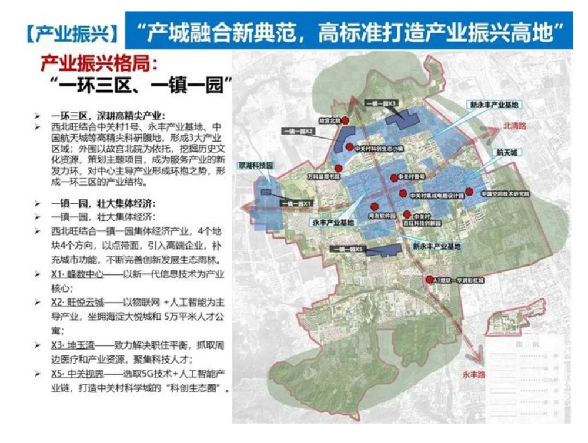

# _

## 规划

1. [西北旺规划](https://www.163.com/dy/article/G76DLD2D05340G59.html)
   

## fagui

### Tips

1. 标准规定 50年 水电气物业都是商用收费，**有的不定有气**
2. 二手售卖，楼下全款，楼下仓储地价加到楼上，昌平仓储最低 7k，海淀 11k
3. 续期，物权法续期；不续期可以给补（具体规定没有）
4. 限竟房自领取房产证后五年才可交易

### Reference

1. [50年产权商品房问题](https://www.anjuke.com/qa/d38251151)
2. [商品房50年vs70年](https://xw.qq.com/cmsid/20200427A05A4X00)
3. [认购书](https://zhuanlan.zhihu.com/p/71134321)
4. [规划数据库](http://plandb.cn/plan/3973)
