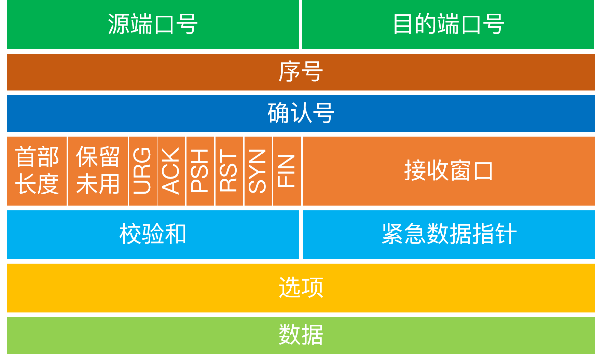

# _

## Basic Structure

                     ----------------------------
                     |    network applications  |
                     |                          |
                     |...  \ | /  ..  \ | /  ...|
                     |     -----      -----     |
                     |     |TCP|      |UDP|     |
                     |     -----      -----     |
                     |         \      /         |
                     |         --------         |
                     |         |  IP  |         |
                     |  -----  -*------         |
                     |  |ARP|   |               |
                     |  -----   |               |
                     |      \   |               |
                     |      ------              |
                     |      |ENET|              |
                     |      ---@--              |
                     ----------|-----------------
                               |
         ----------------------o---------
             Ethernet Cable

                  Figure 1.  Basic TCP/IP Network Node
The boxes represent processing of the data as it passes through the computer, and the lines connecting boxes show the path of data.  The horizontal line at the bottom represents the Ethernet cable; the "o" is the transceiver.  The "*" is the IP address and the "@" is the Ethernet address.

## Terminology

The name of a unit of data that flows through an internet is dependent upon where it exists in the protocol stack.  In summary:

1. if it is on an Ethernet it is called an `Ethernet frame`;
2. if it is between the Ethernet driver and the IP module it is called a `IP packet`;
3. if it is between the IP module and the UDP module it is called a `UDP datagram`;
4. if it is between the IP module and the TCP module it is called a `TCP segment` (more generally, a transport message);
5. if it is in a network application it is called a `application message`

## TCP

### Three Handshake

Build full duplex in three steps
Build one side half duplex in first and second steps
Build another side half duplex in second and third steps

### Four Handshake

Close full duplex in four steps
Close one side half duplex in first and second steps, and `fin_wait_2` statement for final data received
Passive close side change statement to `close_wait` for sending all the final data
When all the final data have send yet, close another side half duplex in third and fourth steps

### Connection

1. On a server, a process is listening on a port. Once it gets a connection, it hands it off to another thread. The communication never hogs the listening port.
2. Connections are uniquely identified by the OS by the following 5-tuple: (local-IP, local-port, remote-IP, remote-port, protocol). If any element in the tuple is different, then this is a completely independent connection.
3. When a client connects to a server, it picks a random, unused high-order source port. This way, a single client can have up to ~64k connections to the server for the same destination port.

So, this is really what gets created when a client connects to a server:

| Local Computer   | Remote Computer           | Role |
|-|-|-|
|0.0.0.0:80       | \<none>                 |LISTENING |
|127.0.0.1:80     | 10.1.2.3:<random_port>  | ESTABLISHED |

here is the output of running netstat again:

    Proto Recv-Q Send-Q Local Address           Foreign Address         State  
    tcp        0      0 0.0.0.0:500             0.0.0.0:*               LISTEN

So now there is one process that is actively listening (State: LISTEN) on port 500. The local address is 0.0.0.0, which is code for "listening for all ip addresses". An easy mistake to make is to only listen on port 127.0.0.1, which will only accept connections from the current computer. So this is not a connection, this just means that a process requested to bind() to port IP, and that process is responsible for handling all connections to that port. This hints to the limitation that there can only be one process per computer listening on a port (there are ways to get around that using multiplexing, but this is a much more complicated topic). If a web-server is listening on port 80, it cannot share that port with other web-servers.

### Sliding Window

#### header

#### Sequence Number

  Every byte has a sequence number. Seq number is the first byte of the data content of the segment.
  Ex: Segment A, the seq is 100, and the content data include 100 byte. So the next segment sequence is 200(1 * 100 + 100)

#### ACK

#### Resend Mechanism

#### Send and Receive cache

#### One message match one ACK

#### Sticking bag and unpacking

#### Congestion control

### UDP

Do not have send cache

## IP

1. The reason for that is the routing. If you have an IP, for example 104.103.84.161 for the www.microsoft.com, every router on the Internet knows, where to send packets to this IP address. They are organized into a tree-like structure in the Internet, where the IP networks of the organizations have a global registry. In the case of the MAC addresses, there is no such thing. From a MAC address you can only see which company manufactured the chip, but no more.

2. MAC addresses are normally fixed in the NIC firmware, while IP addresses can be freely set everywhere.

3. There is also a deeper reason: in the cases of the NIC, there is no guarantee that you want to make IP traffic on them, it is only a quasi-common standard. Earlier existed different protocols (for example, IPX, or the microsoft win2000 servers also had one) which didn't use IP, but another protocol over the NIC cards.

4. IP is the standard of the Internet, while the MAC is the standard of the Ethernet. It is not obligatory to use IP from Ethernet, for example in the ancient times there were ARCNET cards which used a quite different protocol (as I know, their "MAC" were much shorter, too). Or there are VPN protocols which also traffic only IP packets without an Ethernet frame. So, IP is the common of the Internet, and you can connect into it with everything. Most people connects with Ethernet packets but it is not needed.

5. Btw, having an "Internet" which uses MAC addresses instead of IP, would be possible, although it would require to develop the complex protocols and shared databases on every protocol layer to use them. They are developed for IP in the times where the Ethernet didn't even existed. So, the final answer to your question is the social inertia.

## Reference

1. [A TCP/IP Tutorail](https://datatracker.ietf.org/doc/html/rfc1180#page-27)
2. [Why don't we use MAC address instead of IP for having “Internet” or doing communication?](https://networkengineering.stackexchange.com/questions/32358/why-dont-we-use-mac-address-instead-of-ip-for-having-internet-or-doing-commun)